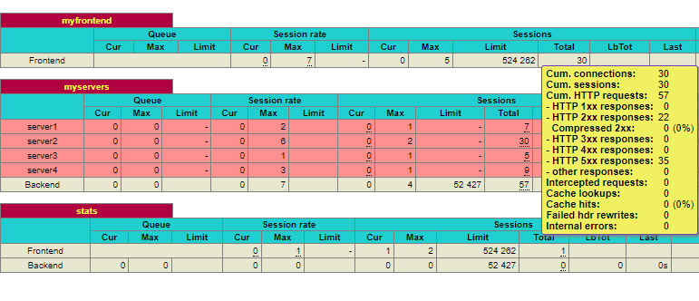

# Load balancer Prototype

Simple load balancer to be used for prototyping

- Setup using Docker image HAProxy and python http server

## Prerequisites

- Docker

## Quickstart

builds, starts the container and spawns 4 servers, minimum 1 server available and a 1% crash probability

```cmd
quickstart.sh 4 1 0.01
```

## Start Loadbalancer

build the Docker image

```pwsh
docker build -t my-haproxy .
```

Validate the configuration file

```pwsh
docker run -it --rm --name haproxy-syntax-check my-haproxy haproxy -c -f /usr/local/etc/haproxy/haproxy.cfg
```

Run the Docker cotaniner starts the loadbalancer

```pwsh
docker run -d -p 8080:80 -p 8404:8404 --name my-running-haproxy --sysctl net.ipv4.ip_unprivileged_port_start=0 my-haproxy
```

### Start servers

From terminal

```pwsh
docker exec -it my-running-haproxy sh -c "python /usr/local/src/main.py -s <number of servers>"
```

From inside the Docker container.

```sh
cd /usr/local/src/
```

```sh
python main.py -s               <#no of servers>
python main.py                  # starts 1 server
python main.py -s 4             # starts 4 servers
```

### Spawn multiple clients

Spawn N simple clients accessing the endpoint <http://localhost:8080/?integer=42> with curl in asynchronous threads and writing to ***"logs/curl_output_clients_N.log"*** .

```pwsh
.\scripts\spawnClients.sh <N:default=100>
```

### Access metrics WORK in progress

Logs are available in the Docker container /var/log/haproxy-traffic.log, maybe mount as volume?

More about the HAProxy logging and logging format [here](https://www.haproxy.com/blog/introduction-to-haproxy-logging).


Access loadbalancer stats from url <localhost:8404/> this can be exported to csv. - See the total column for # of succes/errors response 
Explore more info about the HAProxy stat page [here](https://www.haproxy.com/blog/exploring-the-haproxy-stats-page).